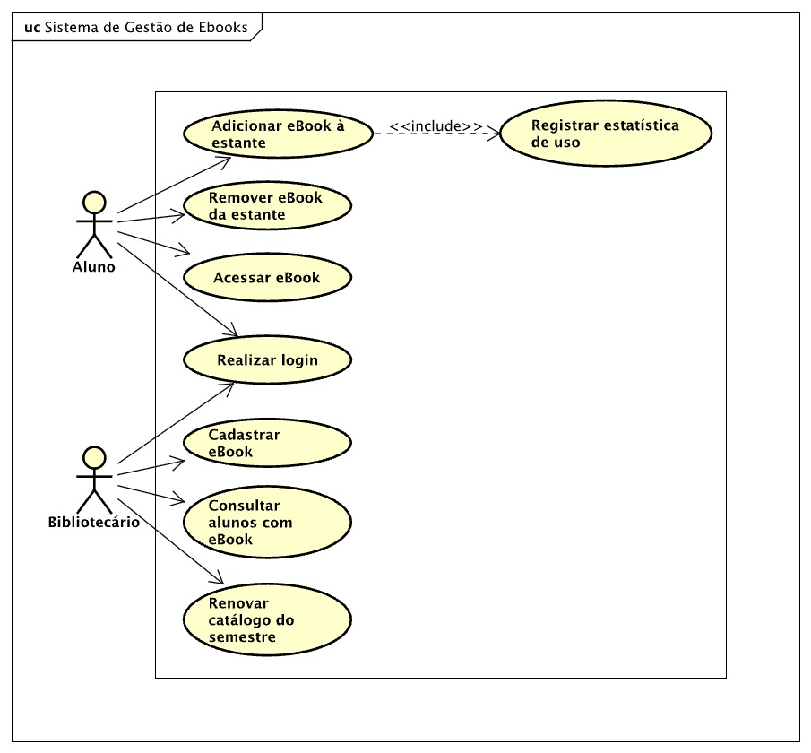

# Sistema de Gestão de eBooks da Biblioteca Universitária

LAB01, Projeto I — Laboratório de Desenvolvimento de Software.

Repositório: <https://github.com/fillmello/lab01-ebooks-biblioteca>

## Descrição do sistema

Uma universidade pretende oferecer aos alunos um acervo de livros digitais (eBooks), cadastrados a
cada semestre pela equipe da biblioteca. Cada eBook tem título, editora, formato de arquivo e
categoria, além de uma licença de uso que limita a 60 os acessos simultâneos ao mesmo título.

Cada aluno monta uma estante pessoal com até 4 eBooks de leitura obrigatória e 2 de leitura livre,
podendo adicionar e remover títulos durante os períodos de acesso do semestre. Um eBook só
permanece no catálogo licenciado no semestre seguinte se, ao final do período de acesso, tiver sido
adicionado à estante de pelo menos 3 alunos.

Cada adição notifica o sistema de estatísticas de uso, para que a biblioteca acompanhe os títulos
mais utilizados. Os bibliotecários podem consultar quais alunos têm determinado eBook em sua
estante, e todos os usuários têm senha para validação do login.

## Documentação

- Diagrama de casos de uso: [docs/diagramas/casos-de-uso.puml](docs/diagramas/casos-de-uso.puml) ([imagem](docs/diagramas/DiagramaCasoDeUso.jpeg))
- Histórias de usuário: [docs/historias-de-usuario.md](docs/historias-de-usuario.md)
- Contribuições semanais: [docs/contribuicoes/](docs/contribuicoes/)

## Distribuição de tarefas

| Integrante | Responsabilidade na Sprint 1 |
| --- | --- |
| Filipe Melo | Diagrama de casos de uso em PlantUML e modelagem dos 8 casos de uso (UC01 a UC08) |
| João Victor | Histórias de usuário correspondentes (HU01 a HU08) |

## Nota de transparência sobre uso de IA

Este projeto utilizou a ferramenta Claude, da empresa Anthropic, como apoio na documentação e na
revisão dos diagramas. O conteúdo foi revisado pelos integrantes antes do commit, e o registro por
integrante e por semana está em [docs/contribuicoes/](docs/contribuicoes/).
