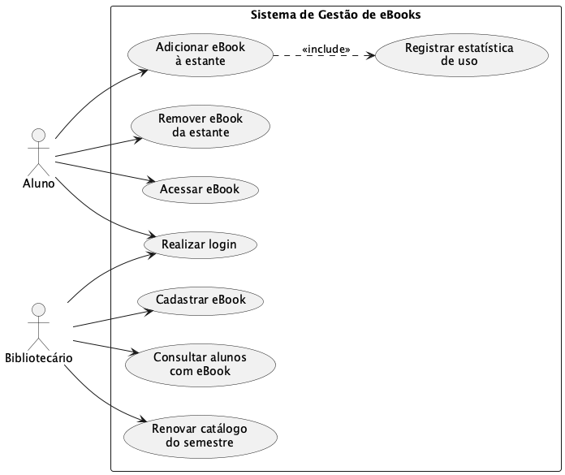

# Sistema de Gestão de eBooks da Biblioteca Universitária

Projeto I — Laboratório de Desenvolvimento de Software, Engenharia de Software, PUC Minas
Campus Lourdes. Laboratório 01 (LAB01).

Repositório: <https://github.com/fillmello/lab01-ebooks-biblioteca>

## Descrição do sistema

Uma universidade pretende oferecer aos alunos um acervo de livros digitais (eBooks). A equipe da
biblioteca cadastra os eBooks disponíveis a cada semestre e mantém as informações sobre os eBooks,
os bibliotecários e os alunos.

Cada eBook possui título, editora, formato de arquivo (PDF, EPUB) e pertence a uma categoria
(literatura, técnico, periódico). Cada eBook tem uma licença de uso que define quantos alunos
podem acessá-lo simultaneamente, limitado a **60 acessos simultâneos**; atingido esse número,
novos acessos ficam bloqueados até que uma licença seja liberada.

Os alunos montam uma estante pessoal com até **4 eBooks de leitura obrigatória** e **2 de leitura
livre**, durante os períodos de acesso do semestre, podendo também remover títulos adicionados
anteriormente. Ao final do período de acesso, um eBook só permanece no catálogo licenciado do
semestre seguinte se estiver na estante de **pelo menos 3 alunos**.

Sempre que um aluno adiciona um eBook à estante, o **sistema de estatísticas de uso** (sistema
externo) é notificado, permitindo à biblioteca acompanhar os títulos mais utilizados. Os
bibliotecários podem consultar quais alunos têm determinado eBook em sua estante. Todos os
usuários possuem senha, usada na validação do login.

## Documentação

| Documento | Caminho |
| --- | --- |
| Diagrama de casos de uso (fonte PlantUML) | [docs/diagramas/casos-de-uso.puml](docs/diagramas/casos-de-uso.puml) |
| Diagrama de casos de uso (imagem) | [docs/diagramas/casos-de-uso.png](docs/diagramas/casos-de-uso.png) |
| Histórias de usuário | [docs/historias-de-usuario.md](docs/historias-de-usuario.md) |
| Contribuições semanais | [docs/contribuicoes/](docs/contribuicoes/) |

### Diagrama de casos de uso



## Equipe e distribuição de tarefas

| Integrante | Casos de uso / Histórias sob responsabilidade |
| --- | --- |
| Filipe Melo | UC01/HU01 Realizar login, UC02/HU02 Adicionar eBook à estante, UC03/HU03 Remover eBook da estante, UC04/HU04 Acessar eBook |
| João Victor | UC05/HU05 Cadastrar eBook, UC06/HU06 Consultar alunos com um eBook, UC07/HU07 Notificar sistema de estatísticas de uso, UC08/HU08 Renovar catálogo do semestre |

O detalhamento por sprint fica em [docs/contribuicoes/](docs/contribuicoes/).

## Sprints

| Sprint | Entregáveis | Status |
| --- | --- | --- |
| Lab01S01 | Diagrama de casos de uso (PlantUML) + Histórias de usuário | Concluída |
| Lab01S02 | Diagrama de classes + projeto Java com stubs | A fazer |
| Lab01S03 | Protótipo com interface e persistência | A fazer |

## Como regerar o diagrama

Os diagramas são versionados em PlantUML (`.puml`) junto com a imagem exportada. Para regerar a
imagem localmente:

```bash
brew install graphviz
java -jar plantuml.jar -tpng -charset UTF-8 docs/diagramas/casos-de-uso.puml
```

Alternativamente, cole o conteúdo do `.puml` em <https://plantuml.online/> e exporte a imagem.

## Nota de transparência sobre uso de IA

Este projeto utilizou a ferramenta Claude (Anthropic) como apoio na revisão dos diagramas em
PlantUML, na redação das histórias de usuário e na organização da documentação do repositório.
Todo o conteúdo foi revisado pelos integrantes antes do commit. O registro detalhado de onde a
ferramenta foi usada, por integrante e por semana, está nos arquivos de
[docs/contribuicoes/](docs/contribuicoes/).
