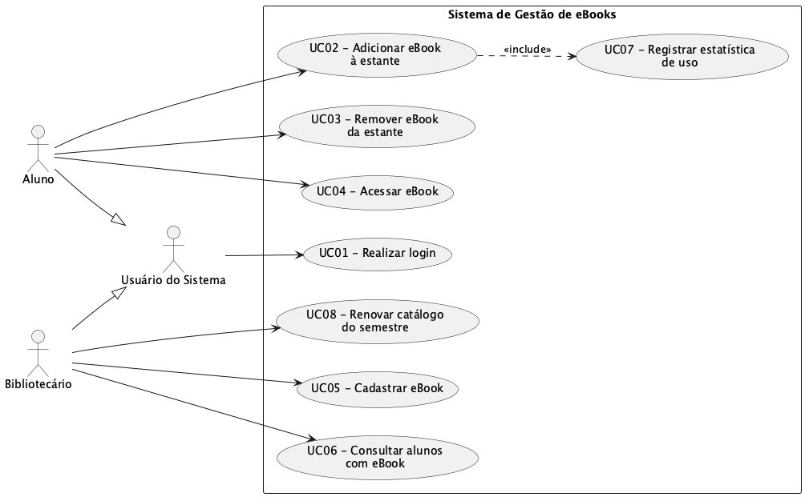
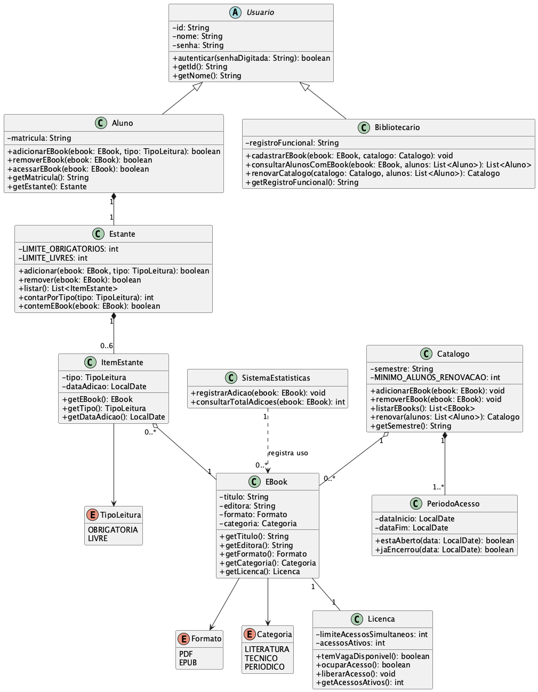

# Sistema de Gestão de eBooks da Biblioteca Universitária

LAB01, Projeto I — Laboratório de Desenvolvimento de Software.

Repositório: <https://github.com/fillmello/lab01-ebooks-biblioteca>

## Descrição do sistema

Sistema para gerenciar o acervo de livros digitais (eBooks) de uma biblioteca universitária. Os
bibliotecários cadastram e mantêm o catálogo licenciado a cada semestre, e os alunos montam uma
estante pessoal com os títulos que vão usar no período, respeitando os limites das licenças de uso.

O sistema também registra as estatísticas de uso do acervo, que impactam diretamente na renovação das licenças
no semestre seguinte, e permite aos bibliotecários acompanhar quais alunos estão com cada título.

## Sprint 1 (Lab01S01) — Modelo de Análise

- Diagrama de casos de uso: [casos-de-uso.puml](docs/diagramas/casos-de-uso.puml) ([imagem](docs/diagramas/DiagramaCasoUsoPuml.png))
- Histórias de usuário: [docs/historias-de-usuario.md](docs/historias-de-usuario.md)



A modelagem geral foi feita primeiro no Astah
([DiagramaCasoUsoAstah.jpeg](docs/diagramas/DiagramaCasoUsoAstah.jpeg)), para discussão dos casos de
uso, e depois transformada em PlantUML. O diagrama do Astah não reflete os ajustes feitos depois da
conversão: a numeração dos casos de uso e o ator "Usuário do Sistema" foram decisões tomadas já na
etapa do PlantUML, que é a versão vigente.

## Sprint 2 (Lab01S02) — Projeto Estrutural

- Diagrama de classes: [diagrama-de-classes.puml](docs/diagramas/diagrama-de-classes.puml) ([imagem](docs/diagramas/DiagramaClassesPuml.png))
- Projeto Java: [src/br/edu/pucminas/biblioteca/modelo/](src/br/edu/pucminas/biblioteca/modelo/)



Cada classe é rastreável a um caso de uso da Sprint 1. Os métodos estão como stub, para serem
implementados na Sprint 3.

Para compilar:

```bash
javac -d out $(find src -name '*.java')
```

## Distribuição de tarefas

### Sprint 1, casos de uso e histórias

As histórias de usuário foram levantadas em conjunto, em aula. Os casos de uso foram divididos:

| Integrante | Casos de uso e histórias sob responsabilidade |
| --- | --- |
| Filipe Melo | 01 Realizar login, 02 Adicionar eBook à estante, 03 Remover eBook da estante, 04 Acessar eBook |
| João Victor | 05 Cadastrar eBook, 06 Consultar alunos com um eBook, 07 Registrar estatística de uso, 08 Renovar catálogo do semestre |

### Sprint 2, agregações de classes

Mantida a mesma divisão da Sprint 1:

| Integrante | Agregação | Classes |
| --- | --- | --- |
| Filipe Melo | `ItemEstante o-- EBook` | Usuario, Aluno, Estante, ItemEstante, Licenca, TipoLeitura |
| João Victor | `Catalogo o-- EBook` | Bibliotecario, EBook, Catalogo, PeriodoAcesso, SistemaEstatisticas, Formato, Categoria |

O registro semanal de cada integrante fica em [docs/contribuicoes/](docs/contribuicoes/), um arquivo
por sprint.

## Nota de transparência sobre uso de IA

Este projeto utilizou a ferramenta Claude, da empresa Anthropic, como apoio na documentação e na
revisão dos diagramas. O conteúdo foi revisado pelos integrantes antes do commit, e o registro por
integrante e por semana está em [docs/contribuicoes/](docs/contribuicoes/).
